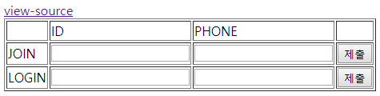

# webhacking.kr (200 pts, SQL)

## old-59*

```php
<?php
  include "../../config.php";
  if($_GET['view_source']) view_source();
  $db = dbconnect();
  if($_POST['lid'] && isset($_POST['lphone'])){
    $_POST['lid'] = addslashes($_POST['lid']);
    $_POST['lphone'] = addslashes($_POST['lphone']);
    $result = mysqli_fetch_array(mysqli_query($db,"select id,lv from chall59 where id='{$_POST['lid']}' and phone='{$_POST['lphone']}'"));
    if($result['id']){
      echo "id : {$result['id']}<br>lv : {$result['lv']}<br><br>";
      if($result['lv'] == "admin"){
      mysqli_query($db,"delete from chall59");
      solve(59);
    }
    echo "<br><a href=./?view_source=1>view-source</a>";
    exit();
    }
  }
  if($_POST['id'] && isset($_POST['phone'])){
    $_POST['id'] = addslashes($_POST['id']);
    $_POST['phone'] = addslashes($_POST['phone']);
    if(strlen($_POST['phone'])>=20) exit("Access Denied");
    if(preg_match("/admin/i",$_POST['id'])) exit("Access Denied");
    if(preg_match("/admin|0x|#|hex|char|ascii|ord|select/i",$_POST['phone'])) exit("Access Denied");
    mysqli_query($db,"insert into chall59 values('{$_POST['id']}',{$_POST['phone']},'guest')");
  }
?>
```
소스 코드를 보니 insert 쿼리를 공략해야 할 것 같았다. 일단 `#` 대신 다른 주석으로 공략이 가능한지 확인해봤는데, 회원 정보를 넣고 로그인이 불가능했다. 또한 `id`와 `phone` 모두 admin을 입력할 수 없어서 문자열도 끊어보고 함수로도 우회해봤지만 실패했다. 어느 부분에서 막히는지를 모르겠어서 검색 키워드도 마땅히 생각나지 않았다. 힌트도 받았지만 한 3일 넘게 아무것도 못해서 풀이를 보기로 했다.

SQL의 `reverse` 함수를 사용하는 방법이 있었다. 이 함수는 문자열을 뒤집어주는 역할을 하는데, `addslashes` 함수로 인해 쿼터를 사용할 수 없기 때문에 사용하는 우회 방법이었다. 그리고 insert 할 때 `values` 부분에 컬럼 이름을 사용할 수 있었다. insert 쿼리문으로부터 `chall59` 테이블은 컬럼이 `(id, phone, lv)` 형태로 구성되어 있을 것으로 추측할 수 있다.

풀이는 다음과 같았다. JOIN 할 때 입력 폼의 ID 부분에는 admin을 뒤집어서 입력하고, PHONE에는 임의의 숫자와 `reverse(id)`를 콤마로 구분하여 넣고 주석 처리한다. 그러면 `lv` 컬럼에는 admin이 입력된다. 그 다음 LOGIN 할 때는 `id`와 `phone` 컬럼에 insert 된 내용을 그대로 입력하여 로그인한다. 결과적으로 `lv`가 admin이라는 조건이 성립하기 때문에 문제를 해결할 수 있다.

---

## old-61*
```php
<?php
  include "../../config.php";
  if($_GET['view_source']) view_source();
  $db = dbconnect();
  if(!$_GET['id']) $_GET['id']="guest";
  echo "<html><head><title>Challenge 61</title></head><body>";
  echo "<a href=./?view_source=1>view-source</a><hr>";
  $_GET['id'] = addslashes($_GET['id']);
  if(preg_match("/\(|\)|select|from|,|by|\./i",$_GET['id'])) exit("Access Denied");
  if(strlen($_GET['id'])>15) exit("Access Denied");
  $result = mysqli_fetch_array(mysqli_query($db,"select {$_GET['id']} from chall61 order by id desc limit 1"));
  echo "<b>{$result['id']}</b><br>";
  if($result['id'] == "admin") solve(61);
  echo "</body></html>";
?>
```
쿼리의 결과가 `admin`이면 문제가 풀릴 것으로 보인다. 출력값을 확인해보기 위해 `$_GET['id']`에 `id`를 넣어 `select id from chall61 order by id desc limit 1`과 같은 쿼리문을 만들었다. 그러면 페이지에 **test**라고 출력되는데, 이는 `chall61` 테이블의 `id` 컬럼을 내림차순으로 정렬했을 때의 첫 번째 `id`를 의미한다.

이 문제에서 주어진 select 문에서의 공략 방법이 감이 잡히지 않아 도움을 받았다. `as`를 이용하면 풀 수 있다는 것을 알고 SQL의 Alias 문법을 확인해봤다. Alias는 `SELECT column_name AS alias_name FROM table_name;` 처럼 사용하여 컬럼의 이름을 별칭으로 출력할 수 있도록 해주는 문법이다. `as`를 빼고도 사용이 가능하다.

`id` 변수에 `admin as id`를 넘겨봤는데 반응이 없었다. 싱글쿼터로 감싸지 않으면 컬럼 이름으로 인식하기 때문에 해당 컬럼이 없어서 작동하지 않았다. 하지만 `addslashes` 함수가 있기 때문에 쿼터를 사용할 수 없었다. 그래서 ASCII Hex 값으로 인코딩하여 `0x61646d696e as id`를 넘기려고 했지만 15자 이상 입력할 수 없어서 `as`를 빼고 쿼리를 작동시켜 문제를 해결할 수 있었다.